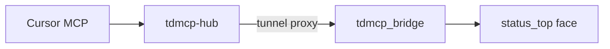
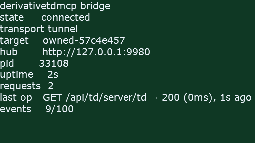
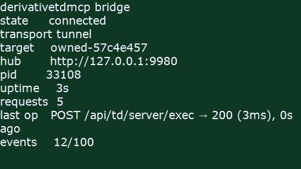

# tdmcp-hub contract (v2 — reverse tunnel)

Long-lived localhost hub for TouchDesigner MCP multi-instance. Cursor’s stdio MCP
process is a **thin consumer**: it calls `ensureHub()` then routes sticky targets
through the hub. **Owned / tunnel peers dial OUT** over WebSocket to the hub; the
hub proxies OpenAPI requests. Per-instance listen ports are **not** required for
`transport: "tunnel"` (the default for `create_td_project` / `inject_td_mcp`).

Legacy `transport: "http"` (TD WebServer listen + `/peers/register`) remains for
lab toes that have not yet been migrated.

## Ports

| Port | Role |
|------|------|
| **9980** | `tdmcp-hub` HTTP + WebSocket `/tunnel` (`127.0.0.1` only) — **only required port for tunnel peers** |
| **9981** | Legacy lab WebServer listen / soft `lab` hint (HTTP transport) |
| **9982** | Reserved — Stagepad |
| **9983** | Reserved — 4designer |

## Upsert (`ensureHub`)

Any Node consumer (Cursor MCP, CLI, tests) and the TD bridge (when `Hubdir` is set)
may **ensure** the hub:

1. `GET http://127.0.0.1:9980/health` — if `app=tdmcp-hub`, done.
2. Else acquire exclusive lockfile (`%TEMP%/tdmcp-hub.lock` / `/tmp/tdmcp-hub.lock`).
3. Spawn detached `node dist/hub.js` (or `Hubdir`/package root resolution).
4. Poll health until ready; release lock.

Concurrent ensurers: waiters poll health while one holder spawns.

Sticky + peer snapshot persist to `%TEMP%/tdmcp-hub-state.json` (tunnel sockets are
reconnected by TD; restored peers start as `tunnelConnected: false`).

## HTTP surface (`127.0.0.1:9980`)

| Method | Path | Body / notes |
|--------|------|----------------|
| `GET` | `/health` | `{ "app": "tdmcp-hub", "ok": true, "version": "…" }` |
| `GET` | `/peers` | `{ "peers": HubPeer[], "selectedId", "expects?" }` |
| `POST` | `/peers/register` | Legacy HTTP peer upsert |
| `POST` | `/peers/expect` | `{ id, nonce, toePath?, projectDir?, label?, ttlMs? }` — pending tunnel hello |
| `POST` | `/peers/heartbeat` | `{ "id": string }` — refresh TTL (HTTP peers) |
| `DELETE` | `/peers/:id` | Remove peer; drop tunnel if any |
| `GET` | `/peers/:id/connected` | `{ id, connected, peer }` |
| `GET` | `/sticky` | `{ "selectedId", "peer" }` |
| `PUT` | `/sticky` | `{ "id": string }` |
| `ALL` | `/proxy/:peerId/api/…` | Proxy OpenAPI call over the peer’s tunnel |

### WebSocket `/tunnel`

1. TD connects to `ws://127.0.0.1:9980/tunnel`.
2. TD sends `hello { type, targetId, nonce, osPid?, toePath?, projectFolder?, projectName? }`.
3. Hub replies `hello_ack { ok, error?, targetId? }` — **rejects** unknown expect or nonce mismatch.
4. Hub → TD: `request { type, id, method, path, query?, headers?, body? }`.
5. TD → Hub: `response { type, id, statusCode, statusReason?, headers?, body? }`.

Per-peer FIFO queue; default request timeout **60s** (override via `x-tdmcp-timeout-ms`).

Liveness = socket. Disconnect marks `tunnelConnected: false` immediately.

## Sticky + MCP tools

- Hub owns durable sticky `selectedId` and peer list across Cursor MCP restarts.
- MCP tools resolve sticky peer from the hub, then call:
  - **tunnel:** `http://127.0.0.1:9980/proxy/<peerId>/api/…`
  - **http (legacy):** `http://127.0.0.1:<peer.port>/api/…`
- Builtin “always list lab @9981” is a soft hint only until a peer registers as `lab`.

## TD bridge (tunnel)

`.tdmcp/state.json` for owned projects:

```json
{
  "targetId": "owned-…",
  "nonce": "…",
  "hubUrl": "http://127.0.0.1:9980",
  "transport": "tunnel",
  "port": 0,
  "toe_launched": "…"
}
```

`tdmcp_port_onstart` (inside `/project1/tdmcp_bridge`) → `utils.tdmcp_tunnel.on_bridge_ready()`:

1. **Main thread:** `capture_snapshot_on_main()` (never touch `op`/`project` from workers).
2. Optional ensure hub via `Hubdir`.
3. Dial `/tunnel`, hello with nonce, reconnect with backoff (**never** silent-death).
4. Dispatch requests into existing `api_controller` via
   `/project1/tdmcp_bridge/tdmcp_port_onstart` **`onFrameStart`** → `process_pending()` on the
   main cook thread (`me.par.framestart` enabled at tunnel start). Do **not**
   drain via `td.run` from the WS worker (`td.app` may work there; `op`/`project`
   do not).

Inject-only: `/local/tdmcp_boot` `loadTox`s the bridge first; create/template already embeds it.

### Bridge face (visible status)

The bridge COMP is no longer a silent brick. At start, `utils.tdmcp_status.ensure_ui`
creates three ops inside `/project1/tdmcp_bridge`:

| Op | Role |
|----|------|
| `status_top` | Text TOP — **Operator Viewer face** (green = connected) |
| `status_text` | Curated summary (state, target, hub, pid, last op, event count) |
| `event_log` | Table DAT — pretty event history, **hard-capped at 100 rows** |

Workers only `record()` into a deque; `flush()` on `onFrameStart` writes DATs/TOP.
Heartbeat “ok” lines are rate-limited (~30s) so long sessions stay quiet.





*Alive and kicking: tunnel up, target id, last `get_td_info`.*



*Just cooked your script: last op shows `POST …/exec → 200`.*

Regenerate screenshots with `TD_MCP_TUNNEL_E2E=1 node scripts/tunnelE2E.mjs`.

**THREAD CONFLICT:** workers must not reference OPShortcut — see monorepo skill
`reference/thread-safety.md`. Lifecycle treats that dialog as a hard start failure.

## TD bridge (legacy HTTP)

When `transport` is missing/`http`: `apply_tdmcp_port` + `tdmcp_hub` register/heartbeat
(v1 behavior). Prefer migrating lab by writing tunnel state + saving the `.toe` once
after template sync.

## Non-goals

- Non-localhost binding.
- Replacing OpenAPI / ToeDigest.
- Changing the MCP tool surface (same tools; transport is under the hub).
